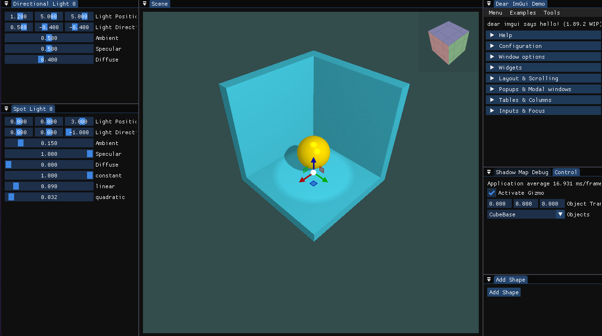

# Teapot
OpenGL Engine - Create graphics apps! 



## Features
* Camera features
    * Arcball camera
    * Camera Panning, zoom in/out
* Objects
    * Rotation/Translation/Scaling features
    * External object suppport (*.obj ...) 
    * Texture support
    * Internal basic object creation (Cube, Cylinder (custom edge count), Plane, Sphere)
* Shadowing
* Multiple lights
    * Directional lights
    * Spot lights
    * Point lights
* Costumiazble docker UI
* External usages - Include in your projects

## How To Install
### Windows
* Clone the git repository recursively
```
git clone --recursive https://github.com/uysalaltas/Teapot.git
```
* From console, create visual studio solution
```
premake5 vs2022
```
* Open the solution file with vs2022
* Compile and run!

### Linux - WSL
This repository also support linux and wsl enviroment. But first you need to have external libraries as follows;

```
libx11-dev
libxcursor-dev
libxinerama-dev
libxi-dev
libx11-dev
libglu1-mesa-dev
libxrandr-dev
libfmt-dev
libassimp-dev
mesa-utils 
libgl1-mesa-dev 
libglu1-mesa-dev 
freeglut3-dev
x11-apps
```

* Clone the git repository recursively
```
git clone --recursive https://github.com/uysalaltas/Teapot.git
```
* From console, update the makefiles and compile with make command
```
./premake5 gmake2
make
```
* Then run the executable
```
sudo ./bin/Debug-linux-x86_64/TeapotApp/TeapotApp
```

> [!IMPORTANT]
> This repository works with C++20, make sure the compiler supports C++ versions (Tested with g++ 13.1).

## 3th Party Libraries
* ImGui
* ImGuizmo
* glm
* GLFW
* GLAD
* Assimp
* stb_image